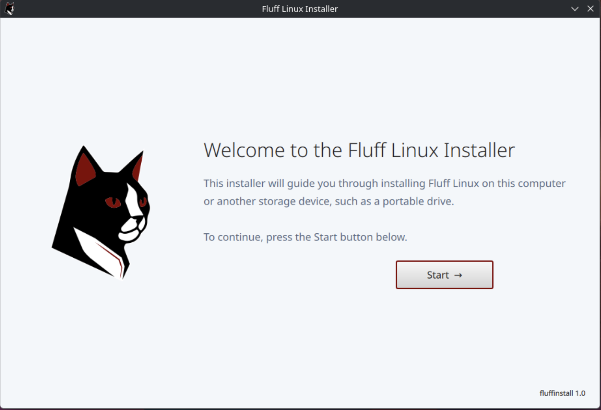
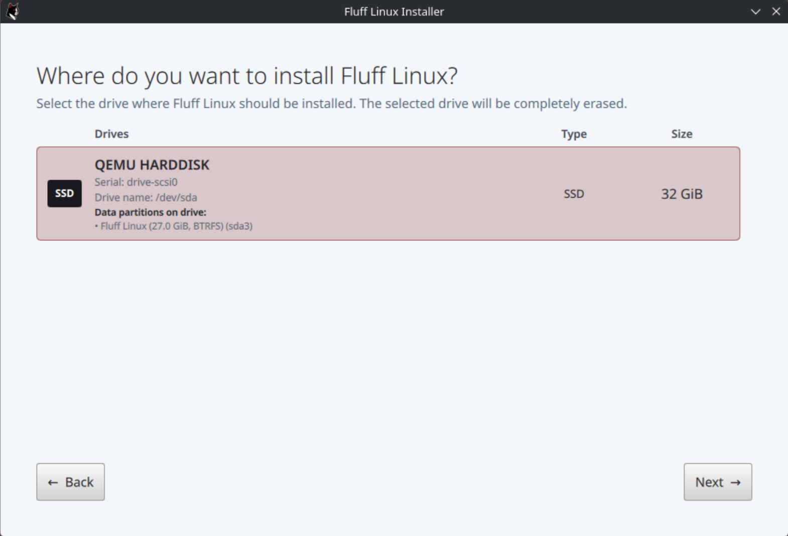
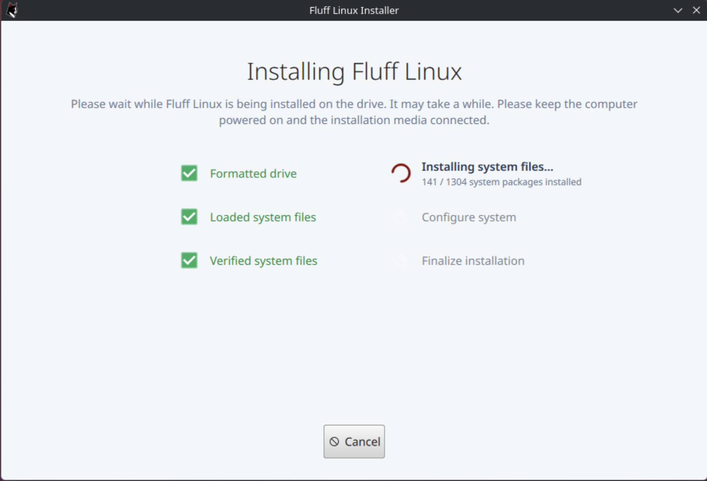

# FluffInstall

FluffInstall is the official installer for Fluff Linux.

Built with Rust and Qt 6, it provides a curated installation workflow for deploying Fluff Linux from the live environment to internal or portable storage. The interface combines detailed drive information, clear installation progress, and useful failure reporting with the established FluffInstall installation process.

## Screenshots

<p align="center">
  
  
  
</p>

## Features

- Guided installation workflow
- Automatic drive discovery and refreshing
- Support for HDDs, SATA SSDs, NVMe SSDs, USB storage, SD cards, and MMC storage
- Drive model, serial number, type, capacity, and device name display
- Existing data partitions shown with their labels, filesystems, sizes, and partition names
- Automatic exclusion of the live installation media
- Automatic selection when only one suitable destination drive is available
- Protection against selecting drives that do not meet the minimum system requirements
- Laptop installation protection when the battery is below 10% and the charger is disconnected
- Clear confirmation before the selected drive is erased
- Live installation stage and task progress
- System file loading, verification, installation, and configuration tracking
- Installation cancellation with active process termination and filesystem cleanup
- Detailed technical errors identifying the command or installation stage that failed

The installer is currently available in English. Language and regional settings are selected through FluffSetup after installation.

## Installation process

FluffInstall guides the installation through the following stages:

1. Selecting an installation drive
2. Reviewing and confirming the selected drive
3. Formatting and partitioning the drive
4. Loading and verifying the system files
5. Installing the system files
6. Configuring the installed system
7. Finalizing the installation

Completed stages are marked clearly, while the active stage displays animated progress and additional information when available.

If installation fails, FluffInstall reports the error in technical form. Error messages identify the failed operation and may include the relevant device, mount point, command, or pacman error. This keeps the interface straightforward while preserving the information needed for troubleshooting.

## FluffSetup and first boot

User creation and other first boot configuration are handled separately by [FluffSetup](https://github.com/FluffNet/fluffsetup).

During installation, FluffInstall creates a temporary `fluffsetup` account and prepares a dedicated FluffSetup session. After rebooting, FluffSetup completes the user-facing configuration of the installed system.

Separating installation from first boot configuration keeps FluffInstall focused on preparing the drive and installing Fluff Linux. It also supports OEM installations by allowing a system to be installed before its final user, account, language, and regional settings are selected.

The live image must provide the following FluffSetup files:

```text
/usr/lib/fluffinstall/fluffsetup/fluffsetup
/usr/lib/fluffinstall/fluffsetup/fluffsetup.desktop
/usr/lib/fluffinstall/fluffsetup/fluffsetup-session
```

FluffInstall verifies that these files are available before formatting begins. If a required installation file is missing, installation stops before the selected drive is modified.

During installation, the files are placed at:

```text
/usr/bin/fluffsetup
/usr/share/wayland-sessions/fluffsetup.desktop
/usr/lib/fluffsetup/fluffsetup-session
```

## Building

FluffInstall should be built inside Fluff Linux or another Arch Linux environment.

### Requirements

Install the required build packages:

```bash
sudo pacman -S --needed base-devel rust cmake clang qt6-base qt6-declarative
```

FluffInstall uses CXX-Qt and the Qt 6 libraries supplied by the system. QML and interface assets are embedded into the executable during compilation.

The dependency list is deliberately kept small. System-provided Qt libraries and standard Linux utilities perform drive discovery, formatting, mounting, system installation, configuration, and bootloader setup.

### Build the application

From the repository root:

```bash
cargo build --release
```

The resulting executable will be located at:

```text
target/release/fluffinstall
```

## License

FluffInstall is distributed under the [MIT License](LICENSE).

Copyright © FluffNet LLC
